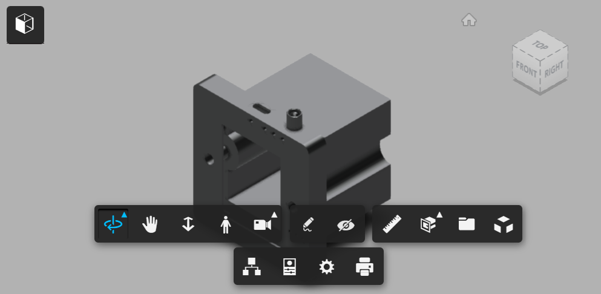

# Multipurpose-Home-Automation-Socket-Using-Unihiker-K10
This repo contains all the coding and circuit diagram related to my home automation project using unihiker K10 

Imagine controlling your light, fan, alarm, and even AC using voice without the need for wifi or a phone.

In this project, I will describe in detail all the processes of making such a device. The 3d printed enclosure fits perfectly on the wall, and connecting to the outlet is super easy.

## The device currently features:
* Voice commands to perform various tasks. (with dual mic)
* Appliance control using TRIAC (1 Fan with dimmer, and 1 Light)
* Appliance control using Infra-Red (1 AC by cloning signal)
* Alarm clock page.
* Four touch sensitive buttons.
* A 2.8-inch color LCD screen.
* Wifi synced Clock.
* Temperature, Humidity, and Light Intensity Measurement.
* Auditory feedback.
* Mobile phone/webpage control (future implementation)

## Components used:
* 1 x UNIHIKER K10 AI Coding Board LINK
* 4 x Capacitive Touch Switch TTP223B LINK
* 4 x 15pF capacitors.
* 1 x USB Samsung adapter 5V 2A
* 1 x 5mm IR LED LINK
* 2 x BT134-600E 4A TRIAC
* 1 x MOV 471k LINK
* 2 x 275V 0.1uF suppression capacitor LINK
* 2 x 0.1uF 450V 104k LINK
* Some resistors and wires

# What it does?

I wanted to make a very practical project. With that in mind, I added multiple features. They are:

### Two Pages:
* Home page
    - shows time, WiFi, appliance status, light intensity, humidity, temperature, alarm time status.
    - Responds to the four buttons:
        - Alarm button:
            - short press: Switches between fan speeds (0 to 4), and stops the alarm if ringing.
            - long press: switches to the alarm page.
        - AC button:
            - short press: Toggles AC ON and OFF with a single press.
        - Fan button:
            - short press: Toggles Fan ON and OFF with a single press.
        - Light button:
            - short press: Toggles Light ON and OFF with a single press.
    - Responds to voice commands:
        - Voice command "Show Alarm": switches to the alarm page.
        - Voice command "Hide Alarm": switches to the main page.
        - Voice command "Fan" : Toggles fan ON and OFF.
        - Voice command "Lights": Toggles light ON and OFF.
        - Voice command "AC": Toggles AC ON and OFF.
        - Voice command "Fan Full speed": sets fan speed to max speed.
        - Voice command "Fan low speed": set the fan speed to the lowest speed.

* Alarm page (24 hour format)
    - shows time, WiFi, alarm logo, alarm time, alarm status, and button functions.
    - Responds to the four buttons:
        - Alarm button:
            - short press: stops the alarm if ringing.
            - long press: switches to the Home page.
        - AC button:
            - short press: Toggles alarm On and OFF.
        - Fan button:
            - short press: increments the minute hand.
        - Light button:
            - short press: increments the hour hand.
    - Responds to voice commands: Same as Home page.

# 3D Files

The 3d structure is made using Fusion360, you can get the file from this link: https://a360.co/4cmEmkP

# The code
The code is located at "Main Code/src/main.cpp". The code has some header file dependency that are located at "Main code/include".
[]Additional two file, the IRRecvDump.cpp code was used to find the raw infra red data from my AC remote control and IRSendBasic.cpp was used to generate and test if my AC properly responds to signal. These two files were not a part of the main code.